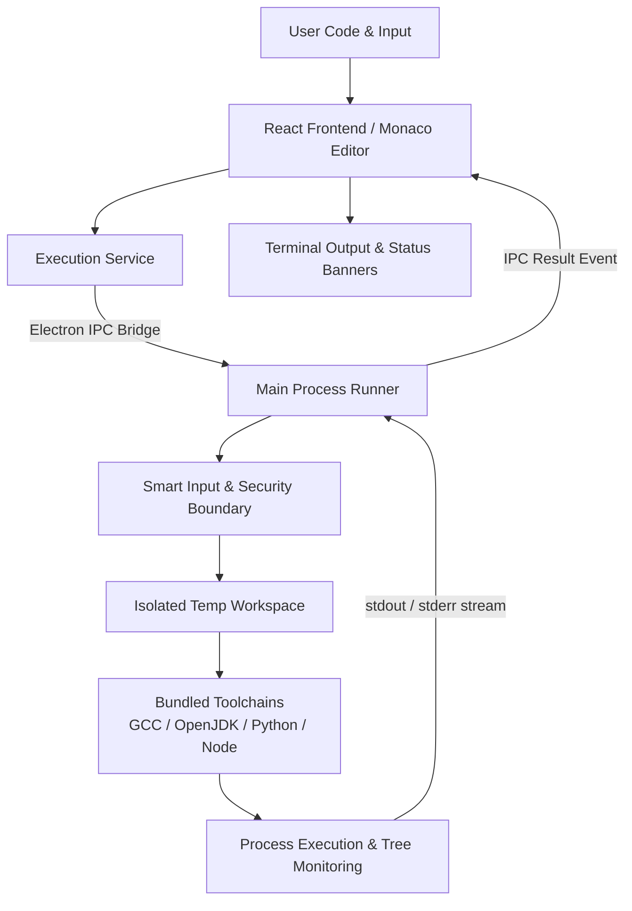

# CODEN — Your Code. Your Machine.

<p align="left">
  
</p>

**CODEN** is an offline-first Windows desktop code compiler and editor designed for speed, privacy, and independence from cloud services. It provides a lightweight, distraction-free environment to write, compile, and execute **Java**, **C**, **C++**, **Python**, and **JavaScript** completely on your local machine using pre-bundled, self-contained compiler toolchains.

---

## ✨ Features

- **Integrated Monaco Editor**: Code authoring powered by Monaco, including syntax highlighting, bracket matching, line numbers, customizable font sizes, indentation settings, and search/replace.
- **Multi-Tab Workflow**: Work across multiple files simultaneously with uncommitted-change dirty indicators and close confirmations.
- **Local Code Execution**: 100% offline compilation and execution—no remote servers, cloud containers, or subscriptions.
- **Integrated Console Panel**: Vertically stacked Input and Output panels with adjustable splitters to feed standard input and view terminal streams.
- **Smart Input Validation**: Language-aware static analysis detects when code expects `stdin` and prompts `"Please enter the input."` if input was omitted, preventing silent deadlocks.
- **Instant Execution (`Ctrl+Enter`)**: Trigger code runs from the editor, from within the Input panel, or globally across the app without unwanted newline insertion.
- **Execution Lifecycle & Process Control**: Immediate process cancellation via `Stop` using process tree termination, paired with configurable execution timeouts.
- **Workspace & File Management**: Built-in Workspace Explorer to open project folders, view directory trees, and create, rename, or delete files directly.
- **File Operations**: Full support for New, Open, Save, Save As (`Ctrl+S`, `Ctrl+Shift+S`, `Ctrl+O`, `Ctrl+N`), and Recent Files tracking.
- **Adaptive Theming**: Native Dark and Light themes with warm obsidian and paper-bright palettes.
- **Compiler Diagnostics & Error Navigation**: Formatted error banners, execution durations, exit codes, and clickable compiler error line jumps.
- **Localhost Development Mode**: Built-in local HTTP execution API supporting browser-based workflows during development.
- **Self-Contained Offline Toolchains**: Bundled runtimes resolve automatically without requiring manual PATH configuration or existing system installations.

---

## 🧑‍💻 Supported Languages

All compilers and runtimes are embedded directly within the application package:

| Language | Environment / Runtime | Version | Compiler / Interpreter |
| :--- | :--- | :--- | :--- |
| **Java** | Eclipse Temurin OpenJDK HotSpot | `25.0.4.1+1` (LTS) | `javac.exe` / `java.exe` |
| **C** | w64devkit (MinGW-w64) | `2.4.0` (GCC `15.2.0`) | `gcc.exe` |
| **C++** | w64devkit (MinGW-w64) | `2.4.0` (G++ `15.2.0`) | `g++.exe` |
| **Python** | Python Embeddable Package | `3.13.15` | `python.exe` |
| **JavaScript** | Node.js Windows x64 Runtime | `22.23.2` (LTS) | `node.exe` |

---

## 📴 Offline-First

CODEN is engineered from the ground up for total offline autonomy:
- **No Cloud Dependencies**: Source code and input data never leave your computer. Compilation and execution occur strictly on your local CPU.
- **Self-Contained Toolchains**: All five language toolchains (GCC/G++, OpenJDK, Python, Node.js) are bundled directly inside application resources (`resources/toolchains/`).
- **Zero Configuration**: No external SDK installations, environment variables, or administrative PATH modifications are required.
- **No Internet Required**: Standard compilation and execution function seamlessly in air-gapped environments, flights, and low-connectivity settings.

*(Note: Clean-machine portability is verified via self-contained bundled binaries; third-party system dependencies are not required.)*

---

## 🧠 Smart Input

To prevent programs from hanging indefinitely on unexpected interactive `stdin` requests, CODEN employs static input detection:

1. **No Input Provided + Program Does Not Require Input**:
   - The program compiles and executes normally without interruption.
2. **No Input Provided + Program Expects Input**:
   - CODEN flags missing input before launch and displays:
     ```text
     Please enter the input.
     ```
   - Execution is safely held until input is supplied in the Input panel.
3. **Input Provided**:
   - Input is streamed into the running process's `stdin` pipe upon execution.

### Detection Coverage
The engine strips comments and string literals prior to inspection, checking language-specific input calls such as:
- **Java**: `Scanner` methods (`nextInt`, `nextLine`, `next`), `BufferedReader.readLine`, `System.in.read`
- **C**: `scanf`, `getchar`, `fgets`, `fscanf(stdin, ...)`
- **C++**: `std::cin`, `cin`, `getline(std::cin, ...)`
- **Python**: `input()`, `sys.stdin.read()`, `sys.stdin.readline()`
- **JavaScript**: `fs.readFileSync(0, ...)`, `process.stdin`, `readline`

---

## ⚡ Execution Architecture

The following diagram illustrates how user code transitions from the UI to local execution:



1. **Frontend Request**: The React renderer collects code, input, language ID, and timeout settings.
2. **Security Gate**: Path normalization and execution boundary checks occur in the Electron main process.
3. **Sandbox Workspace**: Files are staged in an isolated, transient workspace on local disk.
4. **Toolchain Execution**: The respective bundled binary is spawned with non-blocking pipes.
5. **Process Watchdog**: An execution watchdog monitors timeouts and execution cancellation signals.
6. **Result Streaming**: Exit codes, stdout, and stderr are parsed and rendered back to the output console.

---

## 🔒 Security

CODEN enforces strict desktop security boundaries:
- **Renderer Isolation**: `contextIsolation: true` and `nodeIntegration: false` are enforced on the `BrowserWindow`.
- **Preload API Lockdown**: The renderer has no direct access to Node.js built-ins (`fs`, `child_process`, `os`). Communication is restricted to a typed `window.electronAPI` bridge.
- **No Arbitrary Shell Execution**: The backend executes only registered, verified compiler and runtime binaries. Arbitrary command-line strings cannot be dispatched from the renderer.
- **Workspace Traversal Protections**: Path traversal attempts outside authorized project boundaries (e.g. `../../escaped.txt`) are rejected.
- **Safe Process Cleanup**: Cancellations trigger recursive process tree termination (`tree-kill`) to ensure no orphan compiler or runtime processes persist.

---

## 🖥️ UI / UX

- **Monaco Code Canvas**: Familiar VS Code-style keyboard shortcuts, indentation guides, and line highlights.
- **Split Workspace**: Dual horizontal splitters allow flexible resizing between the file tree, the editor, and the console panels.
- **Integrated Console**: A dedicated input area directly above the output feed keeps standard input visible and editable.
- **Visual State Banners**: Clear visual badges for *Success*, *Compilation Error*, *Runtime Error*, *Execution Stopped*, and *Timeout*.
- **Header Toolbar**: Direct access to Language selection, Run (`Ctrl+Enter`), Stop, Workspace toggle, and Settings.

---

## 📸 Screenshots

<!-- Screenshots will be added here for release documentation -->
*(Screenshots can be viewed in the project repository artifacts or taken directly from the running desktop application.)*

---

## 📦 Installation

CODEN is distributed for Windows (x64) in two formats:

### 1. Windows Installer (NSIS)
- **Artifact**: `CODEN Setup 1.0.0.exe`
- **Features**:
  - Full desktop setup wizard
  - Optional custom installation directory selection
  - Start Menu and Desktop shortcuts
  - Clean uninstaller registered in Windows Settings

### 2. Portable Distribution (ZIP)
- **Artifact**: `CODEN-Portable-1.0.0.zip`
- **Usage**:
  1. Download and extract `CODEN-Portable-1.0.0.zip` to any directory or USB drive.
  2. Launch `CODEN.exe`.
  3. No installation or administrative privileges required.

---

## 🚀 Usage

1. **Launch CODEN** via Start Menu, Desktop shortcut, or portable `CODEN.exe`.
2. **Select Language**: Click the language selector in the toolbar (e.g., Java, C++, Python).
3. **Write Code**: Enter your source code into the editor.
4. **Supply Input (Optional)**: If your program reads stdin, enter input lines into the Input panel.
5. **Run**:
   - Click the **Run** button, or
   - Press **`Ctrl+Enter`** (from either the editor or the input panel).
6. **Inspect Output**: View real-time terminal output, exit status, and duration in the Output panel.
7. **Stop Execution**: Click **Stop** at any point to terminate a long-running program.

### Example: Java with Standard Input
```java
import java.util.Scanner;

public class Main {
    public static void main(String[] args) {
        Scanner scanner = new Scanner(System.in);
        System.out.print("Enter your name: ");
        String name = scanner.nextLine();
        System.out.println("Hello, " + name + "! Welcome to CODEN.");
    }
}
```

---

## 🏗️ Architecture

The codebase is organized into clean separation of concerns:

- **Renderer Layer (`src/`)**: React 19 + TypeScript application managing Monaco Editor, state, layout, and tabs.
- **Main Process Layer (`src/electron/`)**: Electron host managing window lifecycles, menu stripping, and configuration.
- **Runner Subsystem (`src/electron/runner.ts`)**: Manages process execution, stdin piping, timeout timers, and `tree-kill`.
- **Toolchain Manager (`src/electron/toolchains.ts`)**: Resolves local offline binaries from bundled resources or development paths.
- **Preload Interface (`src/electron/preload.ts`)**: Frozen `contextBridge` exposing strictly defined, type-safe IPC channels.
- **Local Dev Server (`src/electron/devServer.ts`)**: Express-based local API allowing browser execution during local development.

---

## 📁 Project Structure

```text
CODEN/
├── build/                      # App icon assets (icon.ico, icon.png)
├── dist/                       # Compiled production web bundle
├── dist-electron/              # Compiled Electron main process files
├── dist-packages/              # Built distributions (NSIS exe, Portable zip)
├── src/
│   ├── components/             # React UI components
│   │   ├── CodeEditor/         # Monaco editor integration
│   │   ├── ConsolePanel/       # Input & Output panel
│   │   ├── FileTree/           # Workspace explorer sidebar
│   │   ├── TabBar/             # Document tabs & dirty state
│   │   └── Toolbar/            # Top action bar & language selector
│   ├── electron/               # Electron backend & services
│   │   ├── main.ts             # Application entry & window lifecycle
│   │   ├── preload.ts          # Secure context isolation bridge
│   │   ├── runner.ts           # Process spawn & execution engine
│   │   ├── toolchains.ts       # Offline binary path resolution
│   │   └── fileManager.ts      # Workspace filesystem handlers
│   ├── services/               # Execution & capability detection
│   ├── styles/                 # Theme tokens & UI CSS (theme.css)
│   └── utils/                  # Smart input detection & parsers
├── toolchains/                 # Bundled offline compiler binaries
│   ├── manifest.json           # Toolchain versions & metadata
│   ├── gcc/                    # MinGW-w64 GCC/G++ binaries
│   ├── java/                   # Eclipse Temurin OpenJDK binaries
│   ├── python/                 # Python embeddable distribution
│   └── node/                   # Node.js portable runtime
├── THIRD-PARTY-NOTICES/        # Open source licenses and attributions
├── package.json                # Project dependencies & builder config
├── tsconfig.json               # Renderer TypeScript configuration
└── tsconfig.electron.json      # Main process TypeScript configuration
```

---

## 🔨 Building from Source

### Prerequisites
- **Node.js**: v20.x or v22.x LTS
- **npm**: v10.x or higher
- **Windows (x64)**

### Setup & Development
```bash
# Clone the repository
git clone https://github.com/Angeshkarthik/CODEN_.git
cd CODEN_

# Install dependencies
npm install

# Run in development mode (Vite + Electron)
npm run electron:dev
```

### Production Build & Packaging
```bash
# Compile TypeScript and build production bundle
npm run build

# Package NSIS Installer and Portable ZIP
npm run package:win
```

Packages will be generated in the `dist-packages/` directory:
- `dist-packages/CODEN Setup 1.0.0.exe`
- `dist-packages/CODEN-Portable-1.0.0.zip`

---

## 📄 License & Third-Party Notices

CODEN is licensed under its project terms. Bundled compilers and runtimes retain their respective open-source licenses (GPL with Classpath Exception, GCC Runtime Exception, PSF License, MIT), documented fully in [THIRD-PARTY-NOTICES/](file:///d:/@PROJECTS/Offline%20compiler/THIRD-PARTY-NOTICES).
