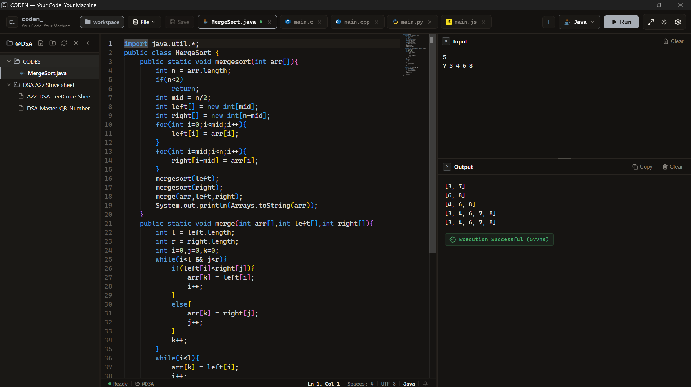
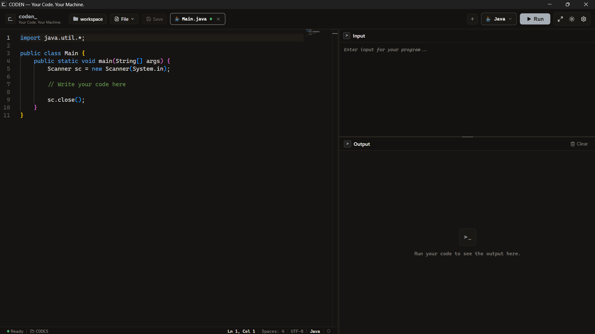
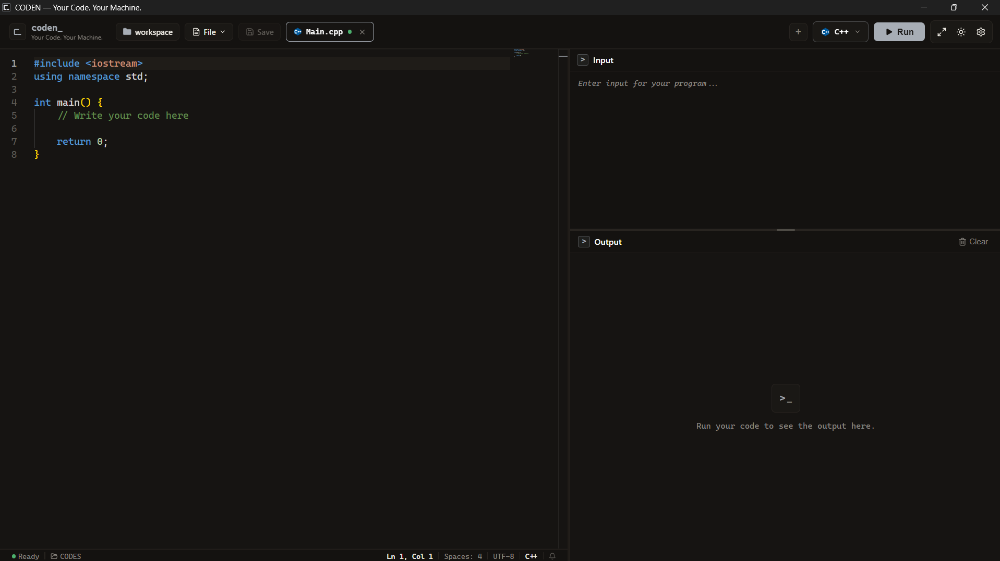
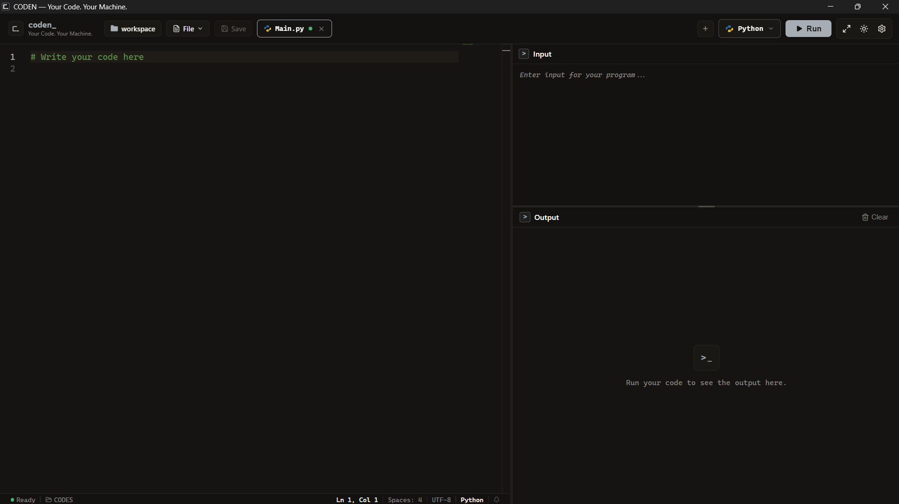
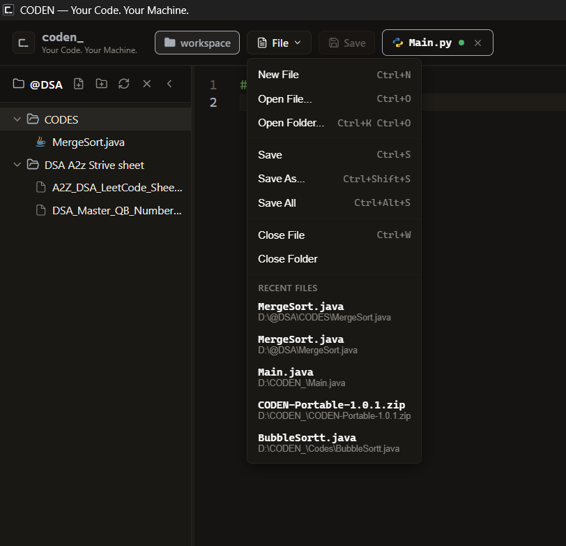
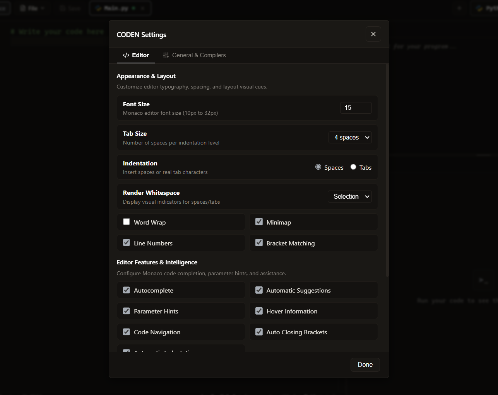

# CODEN — Your Code. Your Machine.

<p align="left">
  
</p>

**CODEN** is a Windows-first offline code compiler and editor that executes supported programming languages locally using bundled toolchains. It provides a self-contained, distraction-free environment to write, compile, and execute **Java**, **C**, **C++**, **Python**, and **JavaScript** directly on your machine without external SDK installations, cloud containers, or internet access.

---

## Current Release: v1.0.3

- **Platform**: Windows x64
- **Distribution**: NSIS Installer (`CODEN Setup 1.0.3.exe`)
- **Execution Model**: 100% Offline / Local Execution
- **Bundled Toolchains**: Included in the installer package
- **Download**: Available via GitHub Releases for this repository once published.

---

## ✨ Features

### 1. Local Code Execution
Execute code entirely on your local machine with zero cloud dependencies:
- **Java**: Full compilation and execution via Eclipse Temurin OpenJDK HotSpot.
- **C**: Native compilation and execution via GCC.
- **C++**: Native compilation and execution via G++.
- **Python**: Script execution via embedded Python 3 runtime.
- **JavaScript**: Local script execution via embedded Node.js runtime.

### 2. Bundled Toolchains
All compilers and runtimes are embedded directly within the application package:

| Language | Environment / Runtime | Version | Compiler / Interpreter |
| :--- | :--- | :--- | :--- |
| **Java** | Eclipse Temurin OpenJDK HotSpot | `25.0.4.1+1` | `javac.exe` / `java.exe` |
| **C** | w64devkit (MinGW-w64) | `2.4.0` (GCC `15.2.0`) | `gcc.exe` |
| **C++** | w64devkit (MinGW-w64) | `2.4.0` (G++ `15.2.0`) | `g++.exe` |
| **Python** | Python Embeddable Distribution | `3.13.15` | `python.exe` |
| **JavaScript** | Node.js Windows x64 Runtime | `22.23.2` (LTS) | `node.exe` |

### 3. Monaco Editor
Full-featured code editor powered by Monaco:
- Syntax highlighting for all supported languages
- Native undo and redo history
- Find, Replace, and Go to Line (`Ctrl+F`, `Ctrl+H`, `Ctrl+G`)
- Autocomplete suggestions and parameter hints
- Hover documentation and code navigation
- Bracket matching and automatic bracket closing
- Configurable font size and line height
- Customizable tab size (spaces vs. tabs)
- Word wrap toggle
- Minimap and line numbers
- Whitespace character rendering
- Language-specific starter templates for quick bootstrapping

### 4. Execution UI & Console
- **Combined Console**: Resizable split layout with vertically stacked Input and Output areas.
- **Flexible Layout**: Resizable editor-to-console divider and resizable Input-to-Output divider.
- **Execution Controls**: Dedicated **Run** and **Stop** buttons.
- **Keyboard Shortcut**: Run instantly with `Ctrl+Enter` from the editor or console.
- **Execution Status**: Real-time status badges (*Running*, *Success*, *Compilation Error*, *Runtime Error*, *Stopped*, *Timeout*).
- **Diagnostics & Error Navigation**: Formatted compiler error banners with clickable line numbers that jump directly to error locations in the editor.
- **Output Tools**: One-click **Clear** and **Copy** output actions.

### 5. Prompt-Aware Input
CODEN inspects source code to detect standard user-input prompts and presents structured, labelled input fields directly in the console.

**Example**:
```c
#include <stdio.h>

int main() {
    int n;
    int arr[100];
    printf("Enter array size: ");
    scanf("%d", &n);
    printf("Enter %d array elements: ", n);
    for (int i = 0; i < n; i++) {
        scanf("%d", &arr[i]);
    }
    printf("Array elements are: ");
    for (int i = 0; i < n; i++) {
        printf("%d ", arr[i]);
    }
    return 0;
}
```

**Console Input Presentation**:
```text
Enter array size:        [ 5                     ]
Enter 5 array elements:  [ 10 20 30 40 50         ]
```

**Output**:
```text
Array elements are: 10 20 30 40 50
```

- **Raw Fallback**: When input patterns are ambiguous or when code reads from `stdin` without identifiable prompts, CODEN automatically falls back to standard raw multiline textarea input.
- *Note: Prompt-aware input is a structured batch-input presentation layer; it is not an interactive terminal.*

### 6. Multi-Tab Editing
- Open and edit multiple files concurrently.
- Per-document editor state (cursor position, undo stack, scroll offset).
- Per-document input and output history.
- Visual dirty-state tracking (dot indicator for unsaved changes).
- Unsaved changes confirmation dialogs on tab close.
- Duplicate-open prevention (switching focus to existing tabs).

### 7. File & Workspace Management
- **File Operations**: New File (`Ctrl+N`), Open File (`Ctrl+O`), Save (`Ctrl+S`), Save As (`Ctrl+Shift+S`), and Save All.
- **Recent Files**: Quick access to recently opened files.
- **Language Detection**: Automatic language mode selection based on file extensions.
- **Workspace Explorer**: Open folder workspace with hierarchical file tree.
- **Tree Actions**: Create new files, create new folders, refresh tree, and delete files.
- **Noise Filtering**: Automatically filters common generated/dependency folders from the tree (`node_modules`, `.git`, `dist`, `build`, etc.).

### 8. Themes & Appearance
- **Dark & Light Modes**: High-contrast, carefully tuned color palettes.
- **Persistent Preferences**: Editor font size, tab sizing, wrap settings, and theme choices are saved across sessions.
- **Fullscreen Support**: Distraction-free coding view.

### 9. Security Architecture
- **Process Isolation**: Electron `contextIsolation: true` and `nodeIntegration: false` enforced.
- **Secure Preload Bridge**: Renderer communicates exclusively via frozen, typed `contextBridge` IPC channels.
- **No Direct Shell Access**: The renderer cannot invoke arbitrary shell commands or access Node.js filesystem modules directly.
- **Toolchain Path Confinement**: Execution dispatches only to verified, pre-configured bundled compiler/runtime binaries.
- **Workspace Path Containment**: Strict canonical path validation prevents directory traversal outside authorized folder boundaries.
- **Safe Process Cleanup**: Cancellation uses tree-kill process termination to prevent orphaned compiler or runtime processes.

### 10. Desktop vs. Browser Environment
- **Desktop (Electron)**: Full local capabilities including native filesystem dialogs, workspace folder access, persistent file operations, and bundled toolchain execution.
- **Browser (Localhost Development Mode)**: Supports local development via the built-in localhost HTTP execution API (`npm run dev`). Browser mode operates with restricted capabilities (in-memory/mock workspace without direct local filesystem access).

---

## 📸 Screenshots

### CODEN Editor
The primary workspace featuring the Monaco editor, prompt-aware input, and execution output.


### Java Execution
Run Java programs locally with stdin support and real-time execution results.


### C++ Execution
Compile and execute C++ programs locally using the bundled toolchain.


### Python Execution
Run Python programs completely offline using the bundled Python runtime.


### Workspace & File Management
Manage files and folders, switch between tabs, and work directly inside your local workspace.


### Settings
Customize editor preferences, appearance, and coding behavior.


---

## 📦 Installation

CODEN v1.0.3 is packaged as a standard Windows x64 installer:

1. Download **`CODEN Setup 1.0.3.exe`** from the GitHub Releases page.
2. Run the installer executable.
3. Follow the setup wizard to select your installation directory and configure shortcut options.
4. Launch **CODEN**. All compilers and runtimes are pre-bundled—no SDK downloads, environment variables, or PATH modifications are needed.

---

## 🚀 Quick Start

1. **Launch CODEN** from the Start Menu or Desktop shortcut.
2. **Open or Create a File**:
   - Use `Ctrl+N` to create a new file or `Ctrl+O` to open an existing file.
   - Or click **Open Folder** in the Workspace panel to load a project directory.
3. **Select Language**: Choose your language from the toolbar dropdown if not automatically detected from the file extension.
4. **Write Code**: Enter your program in the Monaco editor.
5. **Provide Input**:
   - For prompted programs, enter values into the structured prompt fields.
   - For unprompted programs, enter input into the Raw Input console area.
6. **Execute**: Click **Run** or press **`Ctrl+Enter`**.
7. **View Results**: View standard output, execution time, and any compiler diagnostics in the Output panel.

---

## 📁 Repository Structure

```text
CODEN/
├── build/                      # Application icons and packaging assets (icon.ico, icon.png)
├── dist/                       # Compiled production web bundle (Vite)
├── dist-electron/              # Compiled Electron main process and preload scripts
├── dist-packages/              # Built application packages (CODEN Setup 1.0.3.exe)
├── screenshots/                # Application screenshots
├── src/
│   ├── components/             # React UI components
│   │   ├── CodeEditor/         # Monaco editor integration and configuration
│   │   ├── ConsolePanel/       # Input, Output, and PromptInput panels
│   │   ├── FileTree/           # Workspace explorer and file tree sidebar
│   │   ├── Modals/             # Settings, confirmation, and dialog modals
│   │   ├── ResizableLayout/    # Split-panel layout containers
│   │   ├── TabBar/             # Document tabs, dirty-state indicators, and tab controls
│   │   └── Toolbar/            # Top toolbar with language selector and run controls
│   ├── electron/               # Electron backend & desktop services
│   │   ├── devServer.ts        # Local HTTP server for browser development mode
│   │   ├── fileManager.ts      # Workspace and file system operations
│   │   ├── main.ts             # Application lifecycle, window creation, and IPC registration
│   │   ├── preload.ts          # Secure contextBridge IPC bridge
│   │   ├── runner.ts           # Process spawn, stdin streaming, timeout watchdog, and tree-kill
│   │   ├── toolchains.ts       # Bundled toolchain discovery and path resolution
│   │   └── toolDetector.ts     # System toolchain detection
│   ├── services/               # Execution service abstraction (Electron IPC vs Browser HTTP)
│   ├── styles/                 # Application styles and CSS theme tokens
│   ├── types/                  # Shared TypeScript interfaces and type definitions
│   └── utils/                  # Prompt detection, input heuristics, and starter templates
├── toolchains/                 # Bundled offline compiler and runtime binaries
│   ├── manifest.json           # Bundled toolchain versions and metadata
│   ├── gcc/                    # w64devkit MinGW-w64 GCC/G++ distribution
│   ├── java/                   # Eclipse Temurin OpenJDK HotSpot JRE/JDK
│   ├── node/                   # Node.js Windows x64 runtime
│   └── python/                 # Python embeddable Windows distribution
├── THIRD-PARTY-NOTICES/        # Open-source licenses and third-party attributions
├── index.html                  # Main application HTML entry point
├── package.json                # Project dependencies, scripts, and build configuration
├── tsconfig.json               # Renderer TypeScript configuration
├── tsconfig.electron.json      # Electron backend TypeScript configuration
└── vite.config.ts              # Vite bundler configuration
```

---

## ⚠️ Current Limitations

- **Platform Target**: Windows x64 only. Bundled toolchains and binaries are specifically configured for 64-bit Windows environments.
- **Batch-Oriented Stdin**: Input is supplied before or at the start of execution. Interactive terminal emulation (e.g. raw TTY/PTY, curses, interactive REPLs) is not supported.
- **Browser Mode Restrictions**: When running in a browser via the localhost development server, direct desktop filesystem access and native OS dialogs are unavailable.
- **Single Active Execution**: Each document supports one active compilation/execution process at a time.
- **Standard Libraries**: Compilers and runtimes include their standard libraries. Offline mode does not include external package managers (e.g. npm, pip, maven) for installing third-party packages.
- **Scope**: CODEN is a focused offline compiler and code runner. It does not include an interactive terminal, integrated debugger (GDB/PDB), Language Server Protocol (LSP), Git version control interface, or AI assistants.

---

## 🔨 Development & Building

### Prerequisites
- **Node.js**: v20.x or v22.x LTS
- **npm**: v10.x or higher
- **Windows (x64)**

### Available Scripts

| Command | Description |
| :--- | :--- |
| `npm install` | Install project dependencies |
| `npm run dev` | Start Vite dev server and local execution API concurrently |
| `npm run electron:dev` | Start Vite dev server and launch Electron in development mode |
| `npx tsc --noEmit` | Run TypeScript type checking on renderer source |
| `npm run build` | Compile TypeScript and build production web & Electron bundles |
| `npm run package:win` | Build and package the Windows x64 installer |

### Packaging the Installer
To build the production installer:
```bash
# Verify TypeScript
npx tsc --noEmit

# Build production assets
npm run build

# Package Windows x64 NSIS installer
npx electron-builder --win nsis --x64
```
The resulting installer will be located in `dist-packages/CODEN Setup 1.0.3.exe`.

---

## 📄 License & Third-Party Notices

CODEN is licensed under its project terms. Bundled compilers and runtimes retain their respective open-source licenses (GPL with Classpath Exception, GCC Runtime Exception, PSF License, MIT), documented fully in [THIRD-PARTY-NOTICES/](THIRD-PARTY-NOTICES/).
